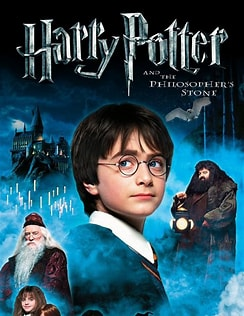
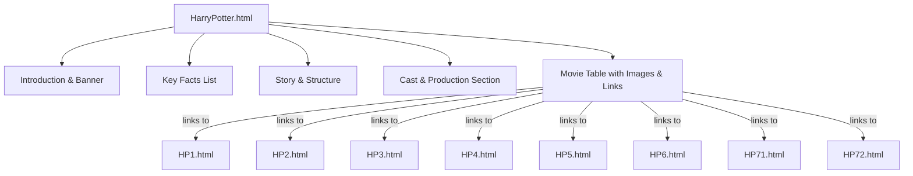
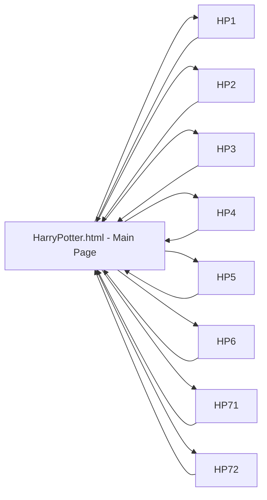

# Harry Potter HTML Website Documentation

This documentation provides an in-depth look at the core HTML files that make up the Harry Potter multi-page website project. Each HTML file represents a specific movie or the series overview, demonstrating essential HTML structures, formatting, multimedia embedding, and interlinking for a rich, portfolio-ready web experience.

---

## HarryPotter.html

This is the **main landing page** for the Harry Potter movie series website. It introduces the franchise, key facts, cast, and provides a visually rich, interactive table-based movie selector.

### Structure and Purpose

- **Website Introduction:** Presents an overview of the Harry Potter franchise, including history, scope, and impact.
- **Key Facts & Story:** Lists franchise statistics and summarizes the overarching narrative structure.
- **Cast and Production:** Highlights the main cast with Wikipedia links and celebrates the UK-centric production.
- **Movie Gallery:** Features a table of movie posters, each linking to its dedicated film page.
- **Visuals:** Uses a large banner image and consistent black/ivory color scheme for a cinematic feel.

### Key Features Table

| Section                   | Description                                                                          |
|---------------------------|--------------------------------------------------------------------------------------|
| Intro & Facts             | Franchise overview, release dates, box office, production credentials                |
| Story and Structure       | Summarizes the narrative arc and film chronology                                     |
| Cast and Production       | Highlights main actors and production notes, includes external links                 |
| Movie List Table          | Interactive table with poster thumbnails and links to each film page                 |
| Visual Consistency        | Uses consistent color, imagery, and headers for brand continuity                     |

### Example: Movie Table Snippet

```html
<table border="1">
  <tr>
    <td>
      <li>
        <br>
        <a href="HP1.html">Harry Potter and the Philosopher’s Stone</a>
      </li>
    </td>
    <!-- ... more movies ... -->
  </tr>
</table>
```

### Visual Structure Flow



---

## HP1.html

This page is dedicated to **Harry Potter and the Philosopher's Stone**.

### Features

- **Title & Branding:** Uses a magical emoji and large heading.
- **Trailer Embed:** YouTube iframe for the official film trailer.
- **Key Facts:** Release date, runtime, box office, awards.
- **Plot and Themes:** Summarizes the story, exploring friendship, courage, and love.
- **Production Highlights:** Discusses set design, costume, and music.
- **Reception:** Details critical response and legacy.

### Example: Key Facts List

```html
<ul>
  <li>Director: Chris Columbus</li>
  <li>Release date: November 16, 2001</li>
  <li>Runtime: 152 minutes (theatrical)</li>
  <li>Box office: Over $1 billion worldwide</li>
  <li>Awards: 3 Academy Awards nominations, 7 BAFTA Awards nominations</li>
</ul>
```

### Trailer Embed

```html
<iframe width="560" height="315" src="https://www.youtube.com/embed/VyHV0BRtdxo?si=RHw3-uk2enCOS4G-" ...></iframe>
```

---

## HP2.html

This file covers **Harry Potter and the Chamber of Secrets**.

### Features

- **Thematic Heading:** Chamber of Secrets, with a lock emoji.
- **Trailer Video:** Official YouTube trailer embedded.
- **Key Facts:** Director, screenplay, release, runtime, box office.
- **Plot and Setting:** Explains the Chamber legend and monster mystery.
- **Cast:** Highlights new and returning characters, including Dobby and Lockhart.
- **Production:** Notes the film's darker tone and critical reception.
- **Legacy:** Discusses its role in franchise development and Richard Harris’s last appearance.

### Example: Plot Summary

```html
<p>
  Harry returns to Hogwarts despite warnings from Dobby the house-elf. When students are mysteriously petrified and ominous messages appear...
</p>
```

---

## HP3.html

Details **Harry Potter and the Prisoner of Azkaban**.

### Features

- **Darker Tone:** Hourglass emoji hints at maturing themes.
- **Trailer:** Embedded for accessibility.
- **Key Facts:** Director, main cast, runtime, studios.
- **Plot:** Focuses on Sirius Black, betrayal, and deeper themes of trust and justice.
- **Visual Style:** Notes Alfonso Cuarón’s directorial changes—muted palette, naturalistic lighting.
- **Expanded Cast:** Discusses newcomers and Michael Gambon as Dumbledore.
- **Legacy:** Recognized as a turning point for the series’ tone.

---

## HP4.html

Represents **Harry Potter and the Goblet of Fire**.

### Features

- **Fire Emoji:** Represents the Triwizard Tournament and rising danger.
- **Trailer Embed:** For user engagement.
- **Key Facts:** Release, director, screenwriter, cast, box office.
- **Plot:** Details the Triwizard Tournament and Voldemort’s resurrection.
- **Production:** Emphasizes spectacle, emotional depth, and a new musical score.
- **Critical Reception:** Notes awards and its pivotal role in the saga's tonal shift.

---

## HP5.html

Covers **Harry Potter and the Order of the Phoenix**.

### Features

- **Shield Emoji:** Symbolizes resistance and Dumbledore’s Army.
- **Trailer:** Embedded for video engagement.
- **Key Facts:** Release, director, runtime, rating, box office.
- **Plot:** Explores ministry denial, Umbridge’s reign, Dumbledore’s Army, and the Department of Mysteries.
- **Production:** Notes David Yates’s debut, adaptation choices, and visual style.
- **Cast:** Highlights Imelda Staunton and new characters.
- **Reception:** Points to critical acclaim and legacy in the series arc.

---

## HP6.html

Focuses on **Harry Potter and the Half-Blood Prince**.

### Features

- **Book Emoji:** Represents the mysterious “Half-Blood Prince.”
- **Trailer:** Embedded for immersive experience.
- **Key Facts:** Director, screenplay, runtime, cast.
- **Plot:** Explores Horcruxes and Voldemort’s past.
- **Production:** Notes cinematography and visual mood.
- **Reception:** Critical praise for maturity, box office success.
- **Legacy:** Establishes groundwork for saga’s conclusion and deepens franchise mythology.

---

## HP71.html

Details **Harry Potter and the Deathly Hallows – Part 1**.

### Features

- **Luggage Emoji:** Represents the trio’s journey and exile.
- **Trailer:** Embedded for previewing.
- **Key Facts:** Release, director, screenwriter, cast, distributor.
- **Plot:** Follows the search for Horcruxes, tone of survival and loss.
- **Production:** Notes stylistic changes—darker, more realistic.
- **Reception:** Recognized for emotional weight and as setup for the finale.

---

## HP72.html

Covers **Harry Potter and the Deathly Hallows – Part 2**.

### Features

- **Crossed Swords Emoji:** Represents the final battle.
- **Trailer:** Embedded for epic conclusion.
- **Key Facts:** Director, release, cast, runtime, box office.
- **Plot:** Follows the Battle of Hogwarts, destruction of Horcruxes, and final duel.
- **Production:** Highlights spectacle and effects.
- **Reception:** Celebrated for emotional closure and record-breaking gross.

---

# Key HTML Concepts Demonstrated

| Concept                       | Example / Use Case                                              |
|-------------------------------|-----------------------------------------------------------------|
| Document Structure            | Proper use of `<!DOCTYPE html>`, `<head>`, `<body>`             |
| Headings and Paragraphs       | `<h1>`, `<h2>`, `<p>` for semantic content                      |
| Text Formatting               | `<ul>`, `<li>`, `<em>` for lists and emphasis                   |
| Embedded Media                | `<iframe>` for YouTube trailers                                 |
| Images                        | `` with `alt` for accessibility                            |
| Links and Navigation          | `<a href="...">` for internal/external links                    |
| Table Layout                  | `<table>` on main page for structured movie list                |
| Meta Tags & Favicon           | `<link rel="icon">` usage                                       |
| Accessibility                 | All images include descriptive `alt` attributes                 |
| Inline & Basic CSS            | `bgcolor`, `style="color: ivory;"` for basic visual styling     |

---

## Multi-Page Navigation Flow



---

## Design and Usability Highlights

- **Consistent Theme:** Maintains black background and ivory text for immersive, cinematic feel.
- **Visual Engagement:** Every movie page opens with a large header and embedded trailer.
- **Accessible:** All images have `alt` attributes; headings are used semantically.
- **Easy Navigation:** Main page serves as the gateway to all movies; users can easily find or return to any film.
- **Extensible:** Simple HTML/CSS makes it easy to upgrade with external stylesheets or JavaScript.

---

```card
{
  "title": "Beginner-Friendly Portfolio",
  "content": "This project is perfect for HTML beginners and makes a strong internship portfolio piece."
}
```

---

# Conclusion

These HTML files collectively build a multi-page, accessible, visually engaging Harry Potter encyclopedia. They demonstrate fundamental HTML skills while offering a solid base for future enhancements with CSS or JavaScript.

For further reference or contributions, visit the [GitHub repository](https://github.com/zylan07/Harry-Potter-My-First-WebSite).

---

```card
{
  "title": "Free Educational License",
  "content": "All files are free for educational and demonstration purposes. Share, modify, and learn!"
}
```
